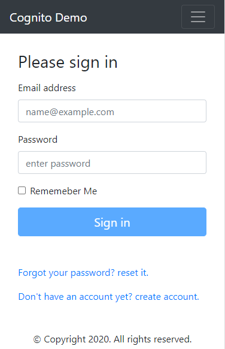
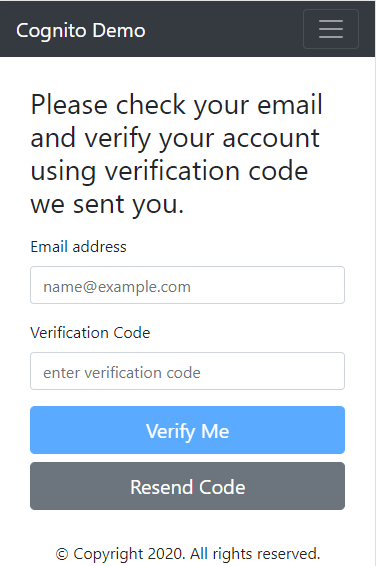
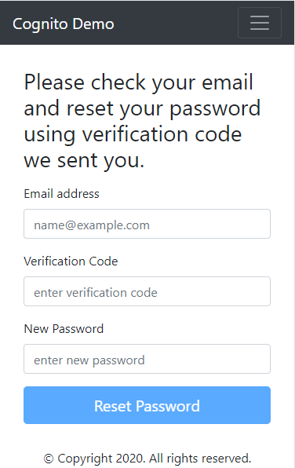

# CognitoUi - AWS Cognito User Authentication Angular App

This project was generated with [Angular CLI](https://github.com/angular/angular-cli) version 10.0.2. \
It is a showcase of using [aws cognito](https://aws.amazon.com/cognito/) as an authentication service with a [nodejs backend](https://github.com/micromin/cognito-auth). 
As you may know, Amazon Cognito lets you add user sign-up, sign-in, and access control to your web and mobile apps quickly and easily.

I hope, this project can be used as a starter for your next idea.

## Pages
- signup
- login
- change password
- reset password initiate
- confirm user email
- resend email confirmation

## Screens

## Running server

Run `ng serve` for a dev server. Navigate to `http://localhost:4200/`. The app will automatically reload if you change any of the source files.

## Clone the and Installing Dependencies

Run `git clone https://github.com/micromin/cognito-ui.git` to clone the repo. Then go to the project's directory and run `npm install` to install all the dependencies.

## Build

Run `ng build` to build the project. The build artifacts will be stored in the `dist/` directory. Use the `--prod` flag for a production build.

## Running unit tests

Run `ng test` to execute the unit tests via [Karma](https://karma-runner.github.io).

## Running end-to-end tests

Run `ng e2e` to execute the end-to-end tests via [Protractor](http://www.protractortest.org/).
